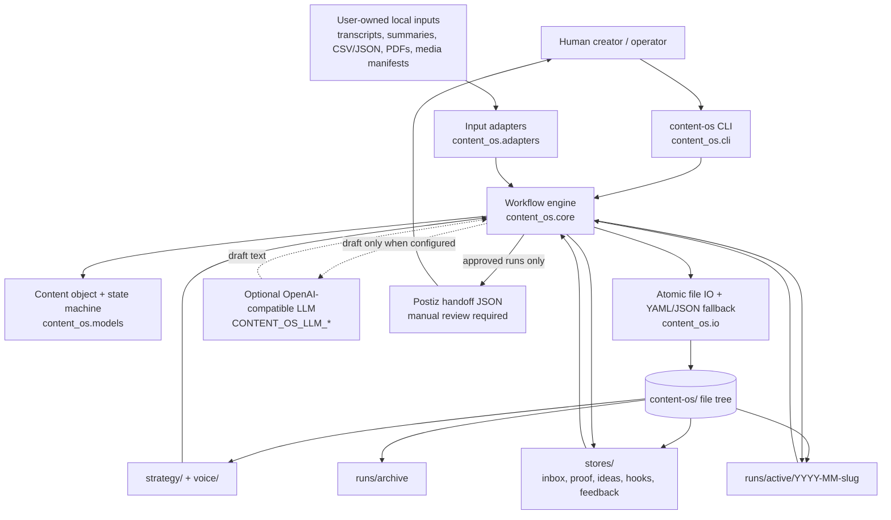
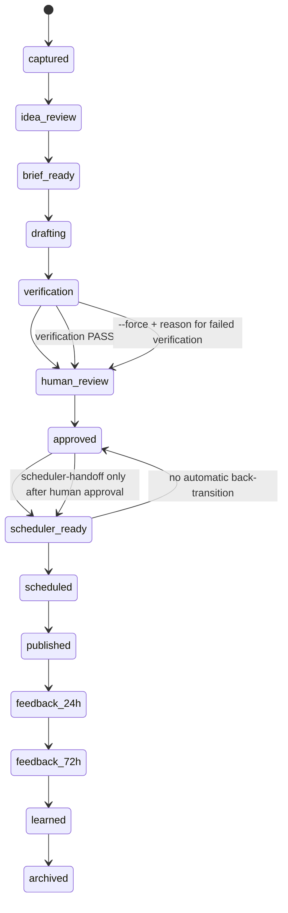

# Content OS Architecture

This document describes how the local-first Content OS implementation is organized, where safety gates live, and how autoingest repository outputs flow into proof-backed content runs.

## System diagram

## Lifecycle gate diagram

## Module responsibilities

| Module | Responsibility | Safety boundary |
|---|---|---|
| `content_os.cli` | Parses command line arguments and maps commands to workflow functions. | Does not publish; `--send-to-postiz` is acknowledged as export-only in this implementation. |
| `content_os.core` | Owns run folders, state updates, brief/draft/verify/approve/handoff/feedback/archive behavior. | Approval gates live here; scheduler handoff and Postiz export require `human_approved=true`. |
| `content_os.models` | Defines routes, formats, lifecycle states, and `ContentObject`. | State transitions are constrained unless a command explicitly forces and records an exception. |
| `content_os.io` | Performs atomic writes, backups, appends, and YAML/JSON serialization fallback. | Existing generated files are backed up where commands rewrite them. |
| `content_os.adapters` | Converts user-provided local inputs into `SourceDocument` records through built-in adapters and declarative rules. | No scraping and no automatic media transcription; binary media becomes a manifest until a user supplies approved text/proof. |

## Data flow

1. `init` creates the Content OS folder tree and human-readable templates.
2. `capture`, `new-run`, or `ingest-source` creates a content object under `runs/active/`.
3. `scan-inputs` and `ingest-source` adapt autoingest outputs into `stores/proof/` and optional run folders. Dynamic adapter rules are read from `integrations/source-adapters.json`.
4. `route` classifies the run, with deterministic heuristics when no LLM is configured.
5. `brief` builds a compact writer context packet from strategy, voice, proof, hooks, and `idea.md`.
6. `draft` either calls an OpenAI-compatible endpoint or writes a no-LLM TODO draft package.
7. `verify` writes scorecard output, avoid-slop matches, exact issues, and required human review notes.
8. `approve` requires passing verification or `--force --reason` for explicit human exception handling.
9. `scheduler-handoff` and `postiz-export` produce handoff artifacts only after approval; they do not publish.
10. `feedback` stores performance-derived lessons in winners/losers/feedback without automatically overwriting voice rules.

## Autoingest integration stance

The autoingest repository contains scripts for local transcription, metadata processing, media analysis, and summaries. Content OS treats outputs from those scripts as user-owned local inputs. It adapts them into proof and run folders but does not call platform scrapers, does not bypass platform rules, does not transcribe binary media by itself, and does not publish content.

## Dynamic adapter rules and source manifest

`content-os init` creates `integrations/source-adapters.json`. The file is a declarative adapter registry: each rule can claim one or more extensions, set the resulting source type, choose route/format defaults, and optionally name JSON keys to extract for title/text. Custom rules are evaluated before built-in adapters, so a team can add support for new exports without editing Python code.

Every imported source gets a SHA-256 hash and stable `source_id`. `ingest-source` records those details in `stores/proof/source-manifest.json` alongside the proof path, run ID, adapter, warnings, and original local path. This makes proof lineage auditable and helps prevent accidental loss of attribution as new data sources are added. `doctor` validates the registry before production use, while scan/ingest fall back to built-in adapters if the registry is malformed so one bad rule does not block local proof capture.
